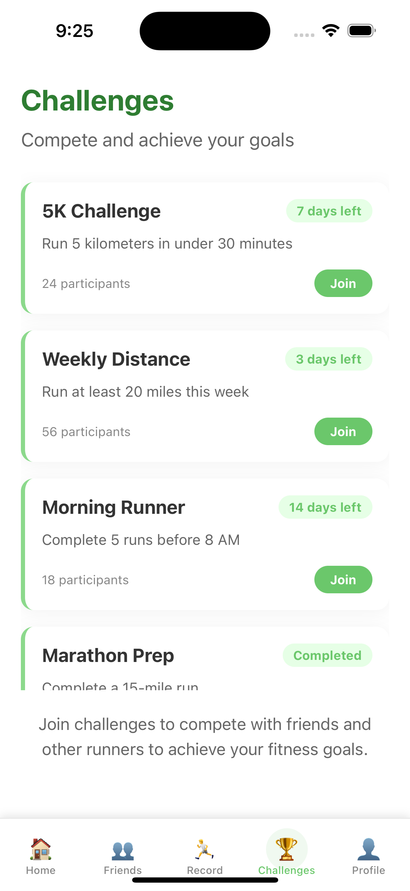
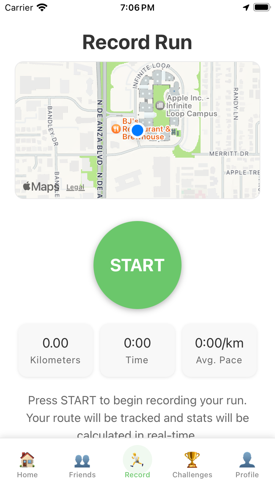
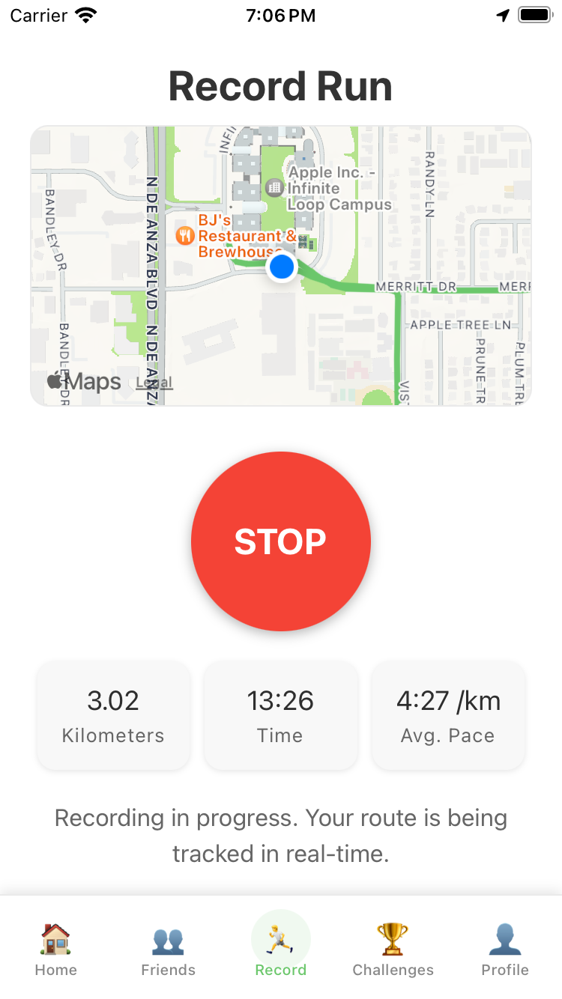
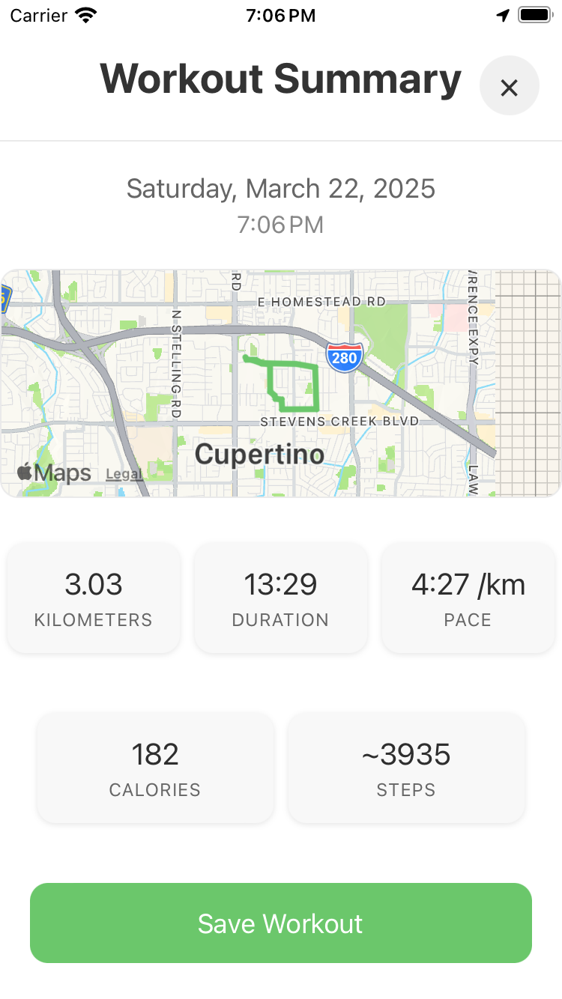

# RunIt

RunIt is a mobile fitness application built with React Native that helps users track their runs, compete with friends, and participate in challenges.

## Repository Structure

This repository contains the frontend code for RunIt. The application connects to a backend service which can be found at:
- Backend Repository: [https://github.com/yirvine/runit-frontend](https://github.com/yirvine/runit-frontend)

## App Overview

RunIt provides a comprehensive running experience with the following features in development:

- **Track Your Runs**: Record your running routes, distance, time, and pace in real-time
- **Connect with Friends**: Add friends and see their running activity
- **Challenges**: Participate in running challenges to stay motivated
- **Personal Profile**: View your running statistics and achievements, fully authenticated by Google via Firebase

## Screenshots

| Profile Page | Friends | Challenges |
|-------------|---------|-----------|
|  |  |  |

| Record Page | Recording a Run | Completed Run |
|------------|----------------|---------------|
|  |  |  |

---

# Getting Started

> **Note**: Make sure you have completed the [Set Up Your Environment](https://reactnative.dev/docs/set-up-your-environment) guide before proceeding.

## Step 1: Start Metro

First, you will need to run **Metro**, the JavaScript build tool for React Native.

To start the Metro dev server, run the following command from the root of your React Native project:

```sh
# Using npm
npm start

# OR using Yarn
yarn start
```

## Step 2: Build and run your app

With Metro running, open a new terminal window/pane from the root of your React Native project, and use one of the following commands to build and run your Android or iOS app:

### Android

```sh
# Using npm
npm run android

# OR using Yarn
yarn android
```

### iOS

For iOS, remember to install CocoaPods dependencies (this only needs to be run on first clone or after updating native deps).

The first time you create a new project, run the Ruby bundler to install CocoaPods itself:

```sh
bundle install
```

Then, and every time you update your native dependencies, run:

```sh
bundle exec pod install
```

For more information, please visit [CocoaPods Getting Started guide](https://guides.cocoapods.org/using/getting-started.html).

```sh
# Using npm
npm run ios

# OR using Yarn
yarn ios
```

If everything is set up correctly, you should see your new app running in the Android Emulator, iOS Simulator, or your connected device.

This is one way to run your app — you can also build it directly from Android Studio or Xcode.

## Step 3: Modify your app

Now that you have successfully run the app, let's make changes!

Open `App.tsx` in your text editor of choice and make some changes. When you save, your app will automatically update and reflect these changes — this is powered by [Fast Refresh](https://reactnative.dev/docs/fast-refresh).

When you want to forcefully reload, for example to reset the state of your app, you can perform a full reload:

- **Android**: Press the <kbd>R</kbd> key twice or select **"Reload"** from the **Dev Menu**, accessed via <kbd>Ctrl</kbd> + <kbd>M</kbd> (Windows/Linux) or <kbd>Cmd ⌘</kbd> + <kbd>M</kbd> (macOS).
- **iOS**: Press <kbd>R</kbd> in iOS Simulator.

## Congratulations! :tada:

You've successfully run and modified your React Native App. :partying_face:

### Now what?

- If you want to add this new React Native code to an existing application, check out the [Integration guide](https://reactnative.dev/docs/integration-with-existing-apps).
- If you're curious to learn more about React Native, check out the [docs](https://reactnative.dev/docs/getting-started).

# Troubleshooting

If you're having issues getting the above steps to work, see the [Troubleshooting](https://reactnative.dev/docs/troubleshooting) page.

# Learn More

To learn more about React Native, take a look at the following resources:

- [React Native Website](https://reactnative.dev) - learn more about React Native.
- [Getting Started](https://reactnative.dev/docs/environment-setup) - an **overview** of React Native and how setup your environment.
- [Learn the Basics](https://reactnative.dev/docs/getting-started) - a **guided tour** of the React Native **basics**.
- [Blog](https://reactnative.dev/blog) - read the latest official React Native **Blog** posts.
- [`@facebook/react-native`](https://github.com/facebook/react-native) - the Open Source; GitHub **repository** for React Native.
